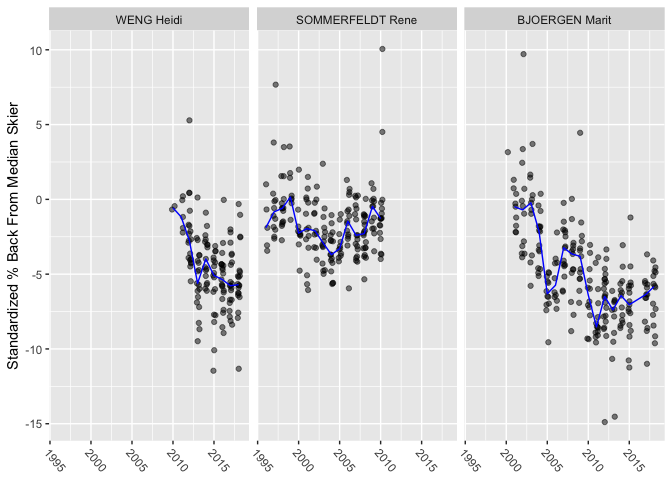
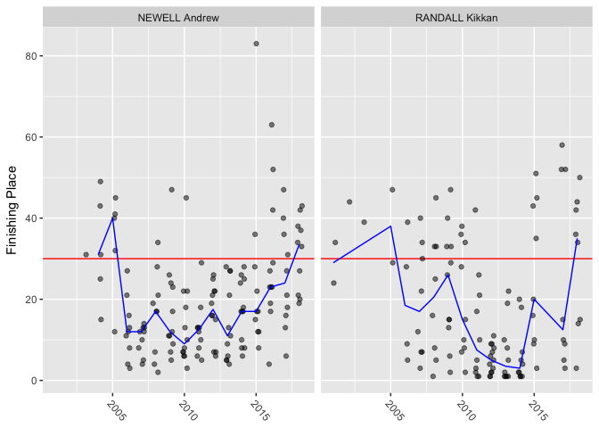
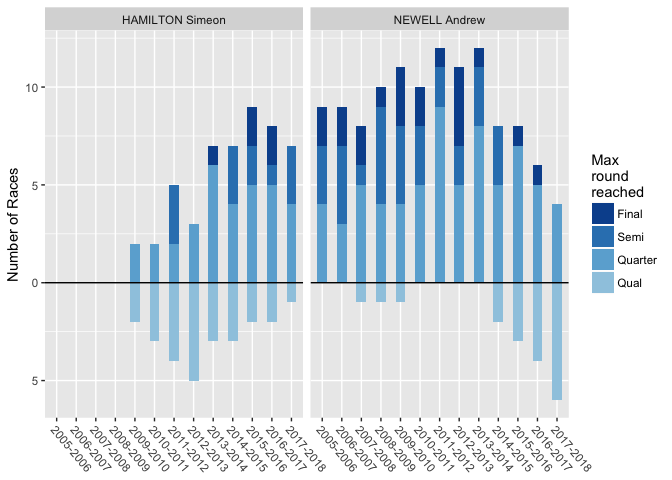
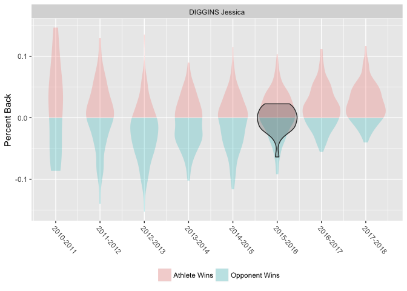
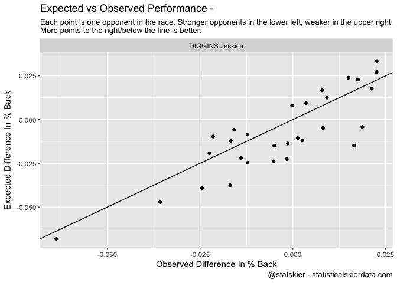
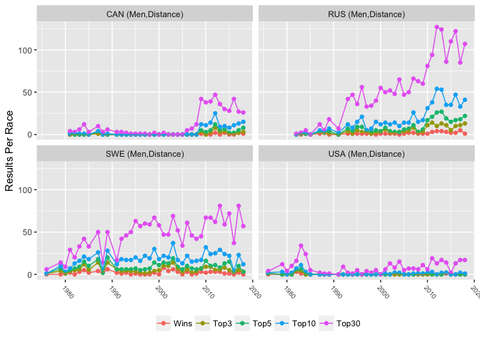
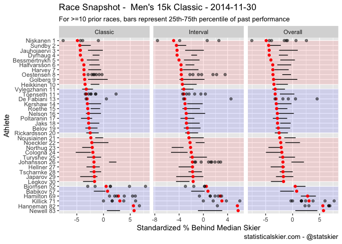
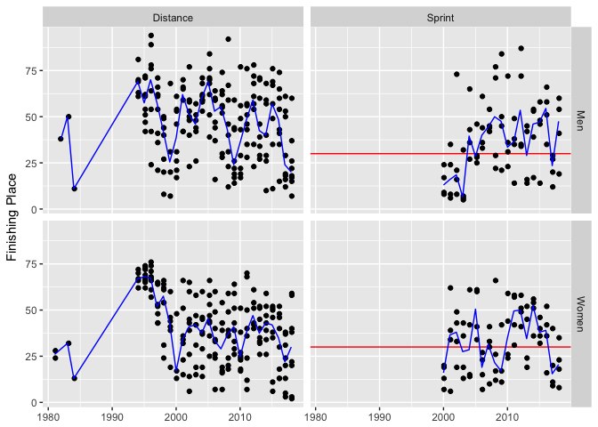
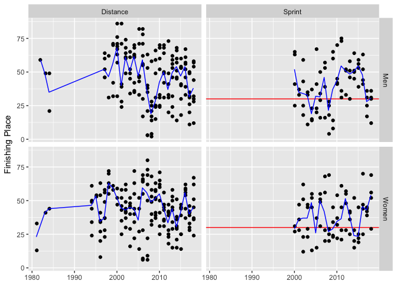

<!-- README.md is generated from README.Rmd. Please edit that file -->
statskier2
==========

This package is a collection of functions I use to explore and analyze cross- country skiing results data that I have collected over the years. The data itself is not included in the package, so the this package isn't actually functional on its own.

Examples
--------

Some basic plots of results by skier. Standardized percent behind the median skier is a custom metric that takes the percent back for each racer relative to the median skier and then performs a simple adjustment to account for differences between race formats (individual start races and mass start races result in very different distributions of percent backs due to tactical differences in the race formats).

``` r
library(statskier2)
p <- ath_plot_dst(ath_names = c("WENG Heidi","SOMMERFELDT Rene","BJOERGEN Marit"))
print(p$plot)
```



``` r

p <- ath_plot_spr(ath_name = c("NEWELL Andrew","RANDALL Kikkan"))
print(p$plot)
```



``` r

p <- spr_plot(ath_names = c('NEWELL Andrew','HAMILTON Simeon'))
print(p$plot)
```



Another way to asses race performance for a given athlete in a single race is to compare how they did against those specific opponents relative to their historical results against just those opponents. The first is a crude attempt using violin plots, where the shaded regions represent past (and future) performances and the black outline represents the race in question.

The second example fits a simple mixed-effects model using race length & technique as fixed effects and random intercept for each opponent to estimate expected results against each opponent.

``` r
p <- hth_race(ath_name = 'DIGGINS Jessica',race_id = 9232,num_opp = 30,min_encounters = 3,measure = 'pb')
print(p$plot)
```



``` r

p <- hth_lmer(ath_names = 'DIGGINS Jessica',race_id = 9232,num_opp = 30,min_encounters = 3,measure = 'pb')
print(p$plot)
```



Simple results trends by nation:

``` r
p <- nation_trend(nations = c('USA','CAN','RUS','SWE'),
                  race_gender = 'Men',
                  race_type = 'Distance')
print(p$plot)
```



Individual race snapshots, to give a quick sense of who raced well or poorly:

``` r
p <- race_snapshot_dst(race_id = 7902,title = "Men's 15k Classic - 2014-11-30")
print(p$plot)
```



World Junior & U23 results over time by nation:

``` r
p <- wjc_u23_plot(nations = c('USA','CAN'),races = 'WJC')
print(p$plots$USA)
```



``` r
print(p$plots$CAN)
```


